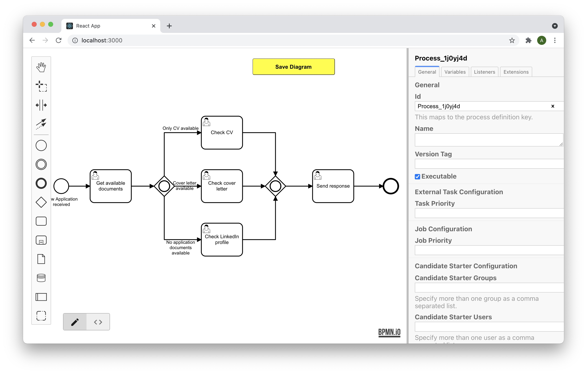

# Camunda Web Modeler

[](https://www.npmjs.com/package/@miragon/camunda-web-modeler)




This is a React component based on [bpmn.io](https://bpmn.io) that allows you to use a fully functional modeler for BPMN
and DMN in your browser application. It has lots of configuration options and offers these features:

- Full support for BPMN and DMN
- Embedded XML editor
- Easily import element templates
- Full support for using bpmn.io plugins
- Access to all bpmn.io and additional events to integrate it more easily into your application
- Exposes the complete bpmn.io API
- Includes type definitions for many of the undocumented features and endpoints of bpmn.io
- TypeScript support

# Usage

## Requirements

- React 17, 18 or 19 (`react` and `react-dom` are peer dependencies).
- A bundler such as Vite, webpack 5 or Next.js. The package is published as ES modules and
  imports the bpmn.io and dmn.io stylesheets itself, so it does not run in Node without a
  bundler. For server-side rendering, load the modeler on the client only, e.g. with
  Next.js: `dynamic(() => import("@miragon/camunda-web-modeler").then(m => m.BpmnModeler), { ssr: false })`.
- The XML tab uses [monaco-editor](https://github.com/microsoft/monaco-editor), which needs
  its editor worker. With Vite, register it before the modeler is loaded:

```ts
import EditorWorker from "monaco-editor/editor/editor.worker?worker";

self.MonacoEnvironment = { getWorker: () => new EditorWorker() };
```

## Getting Started

1. Add this dependency to your application:

```sh
npm install @miragon/camunda-web-modeler
# or
yarn add @miragon/camunda-web-modeler
```

2. Include it in your application:

```tsx
import { BpmnModeler, isContentSavedEvent, ModelerEvent } from "@miragon/camunda-web-modeler";
import React, { useCallback, useState } from "react";

// Your BPMN 2.0 XML, e.g. loaded from your backend.
const BPMN = `<?xml version="1.0" encoding="UTF-8"?>...`;

const App: React.FC = () => {
    const [xml, setXml] = useState(BPMN);

    const onEvent = useCallback((event: ModelerEvent) => {
        if (isContentSavedEvent(event)) {
            setXml(event.data.xml);
        }
    }, []);

    return (
        <div style={{ height: "100vh" }}>
            <BpmnModeler xml={xml} onEvent={onEvent} />
        </div>
    );
};

export default App;
```

3. Replace `BPMN` with your diagram XML and run the application!

The modeler fills its parent element, so give the host element a height.

## Controlled or uncontrolled

Like a React input, the modeler works in two modes:

- **Controlled** (`xml`): you own the document and update it from `content.saved` events, as
  in the example above. Until `xml` is non-empty for the first time, nothing is rendered,
  so you can load the document asynchronously.
- **Uncontrolled** (`defaultXml`): the modeler keeps track of the changes itself. Without
  `xml` and `defaultXml`, it starts with an empty diagram.

## Accessing the modeler

Pass a `ref` to get the bpmn-js instance, the Monaco editor or the current document:

```tsx
import { BpmnModeler, BpmnModelerHandle } from "@miragon/camunda-web-modeler";
import React, { useRef } from "react";

const BPMN = `<?xml version="1.0" encoding="UTF-8"?>...`;

export const Editor: React.FC = () => {
    const modeler = useRef<BpmnModelerHandle>(null);

    const onSave = async () => {
        const { xml, svg } = (await modeler.current?.save()) ?? {};
        console.log("Saved", xml, svg);
    };

    return (
        <div style={{ height: "100vh", position: "relative" }}>
            <button type="button" onClick={() => void onSave()}>
                Save
            </button>
            <button type="button" onClick={() => modeler.current?.getModeler()?.undo()}>
                Undo
            </button>
            <BpmnModeler ref={modeler} defaultXml={BPMN} />
        </div>
    );
};
```

## Full example

All options of the BPMN modeler. Memoize objects you pass (`useMemo`): a new
`bpmnJsOptions` object creates a new bpmn-js instance.

```tsx
import {
    BpmnModeler,
    BpmnModelerHandle,
    isBpmnIoEvent,
    isContentSavedEvent,
    isNotificationEvent,
    isPropertiesPanelResizedEvent,
    isUIUpdateRequiredEvent,
    ModelerEvent,
} from "@miragon/camunda-web-modeler";
import React, { useCallback, useMemo, useRef, useState } from "react";

const BPMN = `<?xml version="1.0" encoding="UTF-8"?>...`;

const App: React.FC = () => {
    const modeler = useRef<BpmnModelerHandle>(null);
    const [xml, setXml] = useState(BPMN);

    const onEvent = useCallback((event: ModelerEvent) => {
        if (isContentSavedEvent(event)) {
            // The user changed the diagram or the XML, or switched views.
            console.log(`Content saved because of ${event.data.reason}`);
            setXml(event.data.xml);
        } else if (isNotificationEvent(event)) {
            // Something the user should see, e.g. an import error.
            console.log(event.data.severity, event.data.message);
        } else if (isUIUpdateRequiredEvent(event)) {
            // Update your toolbar, e.g. undo / redo buttons via the ref.
        } else if (isPropertiesPanelResizedEvent(event)) {
            // In percent of the editor width; can be passed back as propertiesPanel.size.
            console.log(`Properties panel resized to ${event.data.sizePercent} %`);
        } else if (isBpmnIoEvent(event)) {
            // Any bpmn-js event, forwarded as is.
        }
    }, []);

    // Passed to bpmn-js; modules can override services of this library.
    const bpmnJsOptions = useMemo(() => ({ keyboard: { bindTo: document } }), []);

    // Element templates in the Camunda 7 format.
    const elementTemplates = useMemo(() => [], []);

    return (
        <div style={{ height: "100vh" }}>
            <BpmnModeler
                ref={modeler}
                xml={xml}
                onEvent={onEvent}
                bpmnJsOptions={bpmnJsOptions}
                elementTemplates={elementTemplates}
                diagram={{ size: { initial: 70, min: 20, max: 90 } }}
                propertiesPanel={{ hidden: false, size: { initial: 30 } }}
                xmlEditor={{ disabled: false, options: { fontSize: 13 } }}
                classes={{ root: "my-modeler", viewToggle: "my-toggle" }}
            />
        </div>
    );
};

export default App;
```

## Usage with DMN

Usage with DMN is the same: use `<DmnModeler>` (and `DmnModelerHandle` for the `ref`) with
`dmnJsOptions` instead of `bpmnJsOptions`. Element templates don't exist for DMN, and the
properties panel is only shown for the DRD.

## More examples

You can find more examples in our examples
repository [camunda-web-modeler-examples](https://github.com/FlowSquad/camunda-web-modeler-examples).

# Development

You need Node.js 22 or newer (see `.nvmrc`) and Yarn 4 via [Corepack](https://github.com/nodejs/corepack).
Node.js 25 and newer no longer ship Corepack, install it with `npm install -g corepack` there.

```sh
corepack enable
yarn install
yarn dev        # playground with BPMN and DMN at http://localhost:5173
yarn test       # unit and component tests
yarn test:coverage  # the same with a coverage report (coverage/index.html)
yarn lint       # ESLint, warnings fail the check
yarn typecheck  # sources, tests and playground
yarn build      # library output in dist/
```

Pull request titles must follow [Conventional Commits](https://www.conventionalcommits.org/); releases are
created by release-please from them.

# Issues and Questions

If you experience any bugs or have questions concerning the usage or further development plans, don't hesitate to create
a new issue. However, **please make sure to include all relevant logs, screenshots, and code examples**. Thanks!

# API Reference

For the API reference, start with the type definitions in these files and work your way through:

- [options.ts](./src/options.ts) (the props both modelers share)
- [BpmnModeler.tsx](./src/BpmnModeler.tsx)
- [DmnModeler.tsx](./src/DmnModeler.tsx)
- [Events.ts](./src/events/Events.ts)

Upgrading from 0.x? See [MIGRATION.md](./MIGRATION.md).

## Engage with the Miragon team

If you have any questions or need support, feel free to reach out to us via
email ([info@miragon.io](mailto:info@miragon.io)).
We are here to help you, especially if you are considering introducing camunda-web-modeler in your organization.

For inquiries and professional support, please contact us at: [info@miragon.io](mailto:info@miragon.io)

# License

```
/**
 * Copyright 2021 FlowSquad GmbH
 *
 * Licensed under the Apache License, Version 2.0 (the "License");
 * you may not use this file except in compliance with the License.
 * You may obtain a copy of the License at
 *
 * http://www.apache.org/licenses/LICENSE-2.0
 *
 * Unless required by applicable law or agreed to in writing, software
 * distributed under the License is distributed on an "AS IS" BASIS,
 * WITHOUT WARRANTIES OR CONDITIONS OF ANY KIND, either express or implied.
 * See the License for the specific language governing permissions and
 * limitations under the License.
 */
```

For the full license text, see the LICENSE file above.
Remember that the bpmn.io license still applies, i.e. you must not remove the icon displayed in the bottom-right corner.
